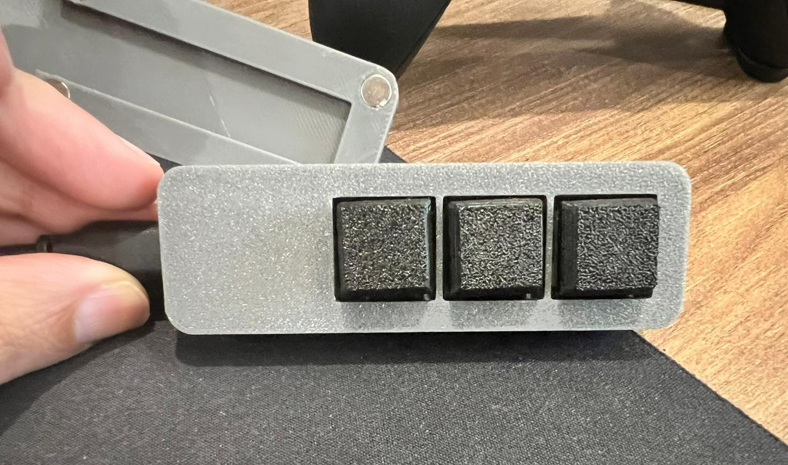
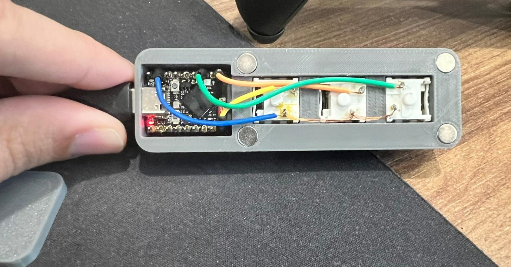
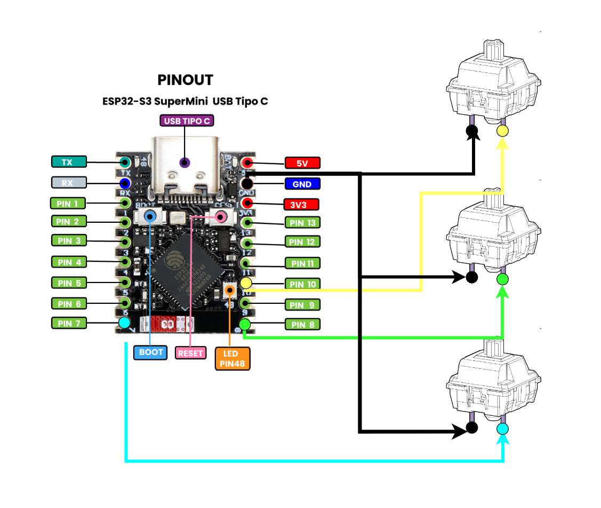
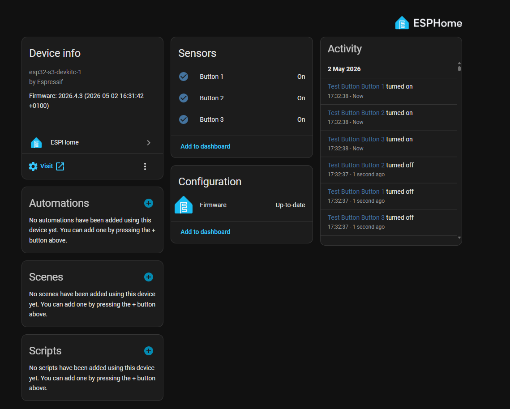

# HAButtonPad

> A compact, 3D printed wireless button controller for Home Assistant — built with ESPHome and the ESP32-S3 SuperMini.



---

## Overview

**HAButtonPad** is an open-source DIY smart button pad that integrates natively with [Home Assistant](https://www.home-assistant.io/) via [ESPHome](https://esphome.io/). It features **3 physical keyboard switches**, each supporting **4 interaction types**:

| Interaction | Description |
|-------------|-------------|
| Single Tap  | Short press and release |
| Double Tap  | Two quick presses |
| Triple Tap  | Three quick presses |
| Hold        | Press and hold for 500ms+ |

That's up to **12 programmable actions** from a single device — all wireless, all local.

The enclosure is fully 3D printed and uses **6x3mm magnets** for a clean, tool-free assembly.

---

## Photos

### Final Product


### Connections Inside the Enclosure


### Wiring Diagram


### Home Assistant Integration


---

## Bill of Materials

| # | Component | Qty | Link |
|---|-----------|-----|------|
| 1 | **ESP32-S3 SuperMini** | 1 | [AliExpress](https://pt.aliexpress.com/item/1005009890133886.html?spm=a2g0o.order_list.order_list_main.5.36f11802cJK5be&gatewayAdapt=glo2bra) |
| 2 | **Keyboard Switches** | 3 | [AliExpress](https://pt.aliexpress.com/item/1005008545427553.html?spm=a2g0o.order_list.order_list_main.136.36f11802cJK5be&gatewayAdapt=glo2bra) |
| 3 | **Magnets 6x3mm** | 8 | [AliExpress](https://pt.aliexpress.com/item/1005009183404175.html?spm=a2g0o.order_list.order_list_main.176.36f11802cJK5be&gatewayAdapt=glo2bra) |
| 4 | **3D Printed Enclosure** | 1 | [MakerWorld](https://makerworld.com/en/models/2747778-habuttonpad-esp32-s3-home-assistant#profileId-3048094) |

---

## Wiring

| Button | GPIO |
|--------|------|
| Button 1 | GPIO7 |
| Button 2 | GPIO8 |
| Button 3 | GPIO10 |

All buttons are wired with one leg to the GPIO pin and the other leg to **GND**. The ESP32 internal pull-up resistors are used, so no external resistors are needed. The signal is inverted in firmware since the buttons pull the pin LOW when pressed.

---

## Firmware

This project uses [ESPHome](https://esphome.io/) and is flashed directly through the Home Assistant UI — no CLI required.

### Prerequisites

- Home Assistant with the **ESPHome add-on** installed
- The ESP32-S3 SuperMini connected via USB to the machine running Home Assistant (for the first flash)

### Setup

1. Open **ESPHome** from the Home Assistant sidebar.
2. Click **New Device** and give it a name (e.g. `HAButtonPad`).
3. When asked for the device type, select **ESP32-S3**.
4. Connect the ESP32-S3 SuperMini via USB and choose the corresponding port when prompted. Wait for the initial firmware to be installed — this may take a few minutes.
5. Once done, the device will reboot and connect to your Wi-Fi automatically.
6. Click **Edit** on the newly created device in the ESPHome dashboard.
7. Open `habuttonpad.yaml` from this repository, copy all of its contents and paste them at the **end** of the config editor.
8. Click **Save**, then click **Install** and choose **Wirelessly**.
9. Wait for the OTA install to complete. Done!

### Button Events in Home Assistant

Each button fires an event that can be used in automations. The event types are:

```
Button 1 - Single Tap
Button 1 - Double Tap
Button 1 - Triple Tap
Button 1 - Hold

Button 2 - Single Tap
...
```

Use these in Home Assistant automations under **Trigger → ESPHome → [event name]**.

### Automation Files

Two ready-to-use automation templates are included in this repository:

| File | Description |
|------|-------------|
| `ha_button1_combined_automation.yaml` | One automation handling all 4 Button 1 actions (single, double, triple tap, hold) using `choose:` — recommended |
| `ha_button1_separate_automations.yaml` | Separate automation per action — useful as a reference |

To use: go to **Settings → Automations → New Automation → three dots → Edit as YAML**, paste the file content and replace the placeholder `entity_id` values with your own.

**Example — one automation for all Button 1 actions:**
```yaml
alias: "HAButtonPad - Button 1"
mode: single
triggers:
  - trigger: event
    event_type: esphome.habuttonpad
    event_data:
      button: "1"
conditions: []
actions:
  - choose:
      - conditions:
          - condition: template
            value_template: "{{ trigger.event.data.action == 'single_tap' }}"
        sequence:
          - action: light.toggle
            target:
              entity_id: light.your_light
      - conditions:
          - condition: template
            value_template: "{{ trigger.event.data.action == 'double_tap' }}"
        sequence:
          - action: scene.turn_on
            target:
              entity_id: scene.your_scene
```

---

## 3D Print

The enclosure uses **8× 6x3mm magnets** pressed into the lid and base for a snap-close fit — no screws needed.

> Print settings and STL files are available on [MakerWorld](https://makerworld.com/en/models/2747778-habuttonpad-esp32-s3-home-assistant#profileId-3048094).

---

## License

MIT — free to use, modify, and share. Attribution appreciated.

---

*Built with ESPHome + Home Assistant. Made to make life easier.*
